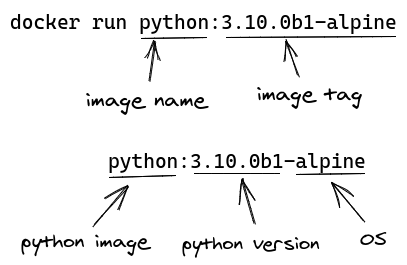

# Application Development with Docker 🐳️

## Who am I
- Arabinda Dora
- ~7 years of experience as a Full Stack Developer
- ~3 years of experience working with Docker and related tools
- Currently Platform Developer at CyGlass project that has a number of Dockerized components
- Written several Docker applications to solve interesting problems

---

## Training Contents
1. Fundamentals of Docker (Day 1)
2. Where Docker is suitable (Day 2)
3. Common Docker operations (Day 2)
4. Building Docker images (Day 3)
5. Packaging applications as Docker images​ (Day 3)

**btw, you get a CDP 😉️**

---

## Fundamentals of Docker (Day 1)
1. What is Docker?
2. Virtual Machines vs. Docker Containers
3. Docker Architecture
4. Docker Installation

### What is Docker
- A containerization or virtualization solution
- Comparable to the tradional virtual machines
- but is lightweight and much more simple to manage and orchestrate

### Virtual Machines vs. Docker Containers


- Tradional virtualiation requires a full guest OS to be installed on top of the host OS. This requires a lot of OS resources and adds to maintenance overhead.
- Modern virtualiation utilizes containers that contain minimal software and share the OS binaries/libraries and so are much less in size.
- VMs can take several minutes to boot up, containers start within seconds.
- Docker images are portable. They can be easily shared, tested, and deployed on different platforms.

### Docker Architecture


- Docker uses a client-server architecture.
- **docker client** is the docker commandline program. it is used to speak to/issue commands to the docker daemon.
- **docker host** is where the docker daemon/server is installed. it does the heavy lifting of running and managing docker images.
- **docker registry** is where all the docker images are stored. We can pull base images from a docker registry, build custom images on top of those, and finally push the newly built images.

### Installation
#### Linux (Ubuntu)
Setup prerequisites
```sh
# updte apt repository
sudo apt-get update

# install dependencies
sudo apt-get install apt-transport-https ca-certificates curl gnupg lsb-release

# download Docker's official GPG key
curl -fsSL https://download.docker.com/linux/ubuntu/gpg | sudo gpg --dearmor -o /usr/share/keyrings/docker-archive-keyring.gpg

# setup apt repository list
echo \
  "deb [arch=amd64 signed-by=/usr/share/keyrings/docker-archive-keyring.gpg] https://download.docker.com/linux/ubuntu \
  $(lsb_release -cs) stable" | sudo tee /etc/apt/sources.list.d/docker.list > /dev/null
```

Install Docker
```sh
sudo apt-get update
sudo apt-get install docker-ce docker-ce-cli containerd.io
```

run docker commands without sudo
```sh
sudo gpasswd -a $USER docker
```

#### Other OS
Follow [documentation](https://docs.docker.com/get-docker/)

### Test!
```sh
$ docker run hello-world

Unable to find image 'hello-world:latest' locally
latest: Pulling from library/hello-world
b8dfde127a29: Pull complete
Digest: sha256:5122f6204b6a3596e048758cabba3c46b1c937a46b5be6225b835d091b90e46c
Status: Downloaded newer image for hello-world:latest

Hello from Docker!
This message shows that your installation appears to be working correctly.
...
```

#### Whoa! what just happened?
- We ran our first ever docker command
```sh
docker run hello-world
```
- `docker run` is a docker client command
- It takes a docker image name as the parameter, `hello-world` in this case
- It speaks to the docker daemon, which then checks if the image is present in the local cache
- If not, it downloads the image from DockerHub and saves it to the local cache. The conversation looks something like this:


- Finally, it runs the image creating an instance of it and producing the output the above output.

### Docker images vs. Docker containers

- Think of a Docker image as a Class in an object-oriented programming language. It encapsulates the information to represent an object and contains additional information about how to create instances of it.
- A container in similar analogy is a running Instance of a Class. Similar to how a class can be instantiated any number of times, we can create any number of containers from an image.

## DockerHub?


- [DockerHub](https://hub.docker.com) is Instagram for Docker images.
- It's the default, public Docker registry where organizations and individual developers upload their public Docker images.

---

## Day 1 practice activities
1. Install Docker by following the [documentation](https://docs.docker.com/get-docker/)
2. Run hello world example: `docker run hello-world`

---

## Common Docker operations (Day 2)
| #   | Command                                      | Description                                                                          |
| --- | -------------------------------------------- | ------------------------------------------------------------------------------------ |
| 1   | `docker pull ubuntu`                         | pull/download `ubuntu` image from DockerHub                                          |
| 2   | `docker images`                              | list all the downloaded images                                                       |
| 3   | `docker rmi image-name`                      | delete image named `image-name`                                                      |
| 4   | `docker run ubuntu`                          | create a container from `ubuntu`                                                     |
| 5   | `docker run -d ubuntu`                       | do #2 in detached mode. it prints the container id.                                  |
| 6   | `docker run --name test ubuntu`              | do #2, give it a friendly name `test`                                                |
| 7   | `docker run -it ubuntu /bin/bash`            | do #2 in interactive mode running `/bin/bash` command                                |
| 8   | `docker run -it --rm ubuntu /bin/bash`       | do #6, remove the container on exit                                                  |
| 9   | `docker ps`                                  | list all the running containers                                                      |
| 10  | `docker rm container-id`                     | delete a container with id `container-id`                                            |
| 11  | `docker stop container-id`                   | stop a running container with id `container-id`                                      |
| 12  | `docker start container-id`                  | start a previously stopped container with id `container-id`                          |
| 13  | `docker run -p 8080:80 ubuntu`               | do #2, bind the host port `8080` with container port `80`                            |
| 14  | `docker run -v /app:/usr/app/src ubuntu`     | do #2, map a folder `/app` on the host with a folder in the container `/usr/src/app` |
| 15  | `docker cp container-id:/home/file.txt .`    | copy `/home/file.txt` from container with id `container-id` to current directory     |
| 16  | `docker cp file.txt container-id:/home/`     | copy file.txt from current directory to `/home/` in container with id `container-id` |
| 17  | `docker build -t image-name -f Dockerfile .` | build an image using `Dockerfile` and tag it as `image-name`                         |

### Learn by scenario: try a new software
#### Approach #1
Download and manually install the OS specific installer 

Con: Manual process. Can conflict with already installed versions. Can leave files behind when uninstalled.

#### Approach #2
Download and run the Docker image

Pro: isolated install. the container and the image can be deleted if not needed anymore.

Example: https://hub.docker.com/_/python
```sh
docker run -it python:3.10.0b1-alpine
```

Example: `examples/python-3.10`

Command Explanation:



- Image naming convention: \<image-name>:\<image-tag>
- image-name is used to identify the software/product 
- image-tag is used for various purposes
  - versioning
  - environmental images
  - specify base OS
  - etc.
- image-tag is optional and the the default value is `latest`
- Re-downloading an existing image (via pull or run command) will automatically download any updates available for the image
  - this includes version upgrades, security patches, base OS updates


- Docker images are made up of several layers
- An example layer is a step that installs your application dependencies
- Each layer is cached separately and gets invalided only if anything related to the layer or the layer above it changes

#### A note about alpine images
1. Alpine OS is a security-focused alternative Linux OS
2. It has a very small diskspace and memory requirements
3. Because of the small size, it's one of the preferred base OS to build Docker images
4. Smaller Docker images are preferred because they are built and deploy fast

#### Use cases
1. Testing your app in different versions of Python before upgrading.
2. Trying new features in the newer version.

### Learn by scenario: build a static site server
A static site has fixed contents, doesn't receive many updates and is identical to all the users. Example: portfolio site.

#### Approach #1
1. Download a webserver image: `nginx`
2. Run the webserver image to create a container
3. Copy static files to the running container

Con: Containers are ephemeral. The copied files will be lost if the container exits.

#### Approach #2
1. Download a webserver image: `nginx`
2. Create a derived image based on the webserver image and package the files with it
3. Run the derived image to create a container

Con: Addition of new files will require rebuild and redploy. Image size gets bigger.

#### Approach #3
1. Download a webserver image: `nginx` (docker pull)
2. Put the static files in a folder in the host machine
3. Map the folder as a volume with the webserver container (docker run)

Pro: No rebuild, no redeploy. Live updates.

Example: `examples/static-site`

Command Explanation:


#### Use cases
1. Static file server (images, styles, etc.)
2. Auto-reload development server (gunicorn, nodemon, etc.)
3. Share files across different containers (pipeline)

## Where Docker(Containers) is suitable (Day 2)
### General use cases
1. Package apps and their dependencies as a single unit
2. Faster build and deploy process
3. Prepare shareable Proof of Concepts
4. Avoid "It works on my machine!" problem
5. Onboard new developers into the team
6. Adopt microservice architecture
7. Try out new software or learn new technologies
8. etc.

### Products utilizing Containers
1. CI/CD Platforms (Gitlab CI)
2. Serverless platforms (AWS Lambda)
3. Vulnerability scanning products
4. Capture The Flag(CTF) hacking competitions ([tryhackme](https://tryhackme.com/))
5. etc.

---

## Day 2 practice activities
1. Refer to the common Docker commands above and try them on your local machine.
2. I wanted to download `ubuntu:18.04` image but I forgot to specify the version/tag `18.04`. What happens?
3. Is it ok use an image with `:latest` tag in production?
4. Is it possible to download two versions of an image? Example: `ubuntu:18.04` and `ubuntu:20.04`?
5. I create a container of `nginx` image by using command #1 below. It starts the container and prints the ID. I use the ID to remove the running container using command #2 below. What happens and how can we fix it?
   1. `docker run -d -p 8080:80 nginx`
   2. `docker rm <container-id>`
6. I try to create two containers of `nginx` image one after another using the commands below. What happens and how can we fix it?
   1. `docker run -d -p 8080:80 nginx`
   2. `docker run -d -p 8080:80 nginx`
7. What is one of the options to keep the size of the Docker image small?

---

## Building Docker images (Day 3)
### Dockerfile
- A text file that contains the instructions needed to create a new container image.
- The instructions include identification of an existing image to be used as a base, commands to be run during the image creation process, and a command that will run when new instances of the container image are created.
- A Dockerfile instruction has the syntax: `INSTRUCTION arguments`
- There are several instructions to perform various actions. Some are listed below.

#### Dockerfile Instructions
- FROM
  - `FROM <image>:<tag>`
  - use `<image>:<tag>` as the base image
- RUN
  - `RUN <command>`
  - run the provided command
- ENV
  - `ENV key val`
  - set an environment value
- COPY
  - `COPY <src> <dest>`
  - copy file/folder `<src>` on the host to a file/folder `<dest>` on the container
- ENTRYPOINT
  - `ENTRYPOINT ["<executable>", "<param1>", "<param2>"]`
  - the executable/command to run when a container of the image is created
- WORKDIR
  - `WORKDIR </path/to/workdir>`
  - Sets the working directory for any RUN, CMD, ENTRYPOINT, COPY instructions that follow it
  - It can be used multiple times in the one Dockerfile

Example: `examples/fullstack/api/Dockerfile`

#### How to select a base Docker image


- There is almost always a base image available in DockerHub for almost all uses cases.
- Follow the tree and ask yourself the questions to find the best base image for your need.
- Keep the Base OS image option (highlighted in blue) as a last resort since you'll need to install your dependencies yourself.

#### Rule of thumb when writing a Dockerfile
- Docker image layers are stacked on top of each other
  - `docker image history cyberchef:api`
- If a layer gets invalidated due to a change, the layer and any following layers are discarded from cache and are rebuilt
- **Rule:** Put **less** frequently updated instructions at the **top** and **more** frequently updates instructions at the **bottom**.

### Let's write a Dockerfile
For the frontend `examples/fullstack/ui`

### Run the fullstack app
`examples/fullstack/run.sh`

### Publish a Docker image
Example: `examples/fullstack/publish.sh`

- Docker follows a very simple mechanism to publish images to Docker registries
- We just need to prefix the image name with the registry path while preparing the image name
- Then we use the `docker push` command to upload the image to the registry
- The path structure is a standard across various Container registries, eg: Gitlab, AWS ECR, etc.

### Docker Networking
- Docker networking is powered by software drivers
- Some of the availble drivers are:
  - bridge
    - default network driver. containers on a the same network bridge can communicate.
  - host
    - remove network isolation between containers and the host and use host's networking rules.
  - overlay
    - connect multiple Docker hosts and enable containers cross-communicate. Example: Docker swarm.
- Docker creates some default networks using the available drivers when installed
- Created containers are connected to the default bridge network unless a network is specified 
- We can create custom networks by choosing any of the available drivers
- Reference: [documentation](https://docs.docker.com/network)

#### Why do we need a custom network
- When we expose container ports exposed to the host, all/unrelated containers on the default network can see them
- Create a custom network to isolate your related containers and prevent other containers seeing them
- If you name your container, Docker creates a DNS name for the container IP using the name. Thus, other contaienrs in the same network can access the container using the name.

#### Examples:
1. List all available networks
   - `docker network ls`
2. Create a network optionally using a driver
   - `docker network create <name> -d <driver>`
   - `docker network create custom-nw -d bridge`
3. Create a container in a custom network
   - `docker run --name proxy --net custom-nw -p 80:80 -d nginx`
4. Check the network configuration of a container
   - `docker inspect proxy`

## Container Orchestration
- Managing containers becomes difficult when we have a complex architecture involving a number of containers.
- This is where tools like `docker-compose` can help.
- We write a manifest file and use the tool to build and deploy the application

### Example
- manifest file: `examples/fullstack/docker-compose.yml`
- Build the images and run the containers: `docker-compose up`
- Stop and delete the containers: `docker-compose down`

## Real-world examples
1. CyGlass WMS
2. CyGlass Agent Builder

## Assessment
- Write a Math API that has endpoints to solve the below functions​
  1. Fibonacci​
  2. Factorial​
- Use a programming language or web framework of your choice​
  - If you are unfamiliar with this, you could use [this resource](https://flask.palletsprojects.com/en/2.0.x/quickstart/#a-minimal-application)
- Dockerize the application​
  - explore DockerHub and choose the best image possible for you API
- Upload the image to a public container registry
  - Example registries: DockerHub, Gitlab
- Document​
  1. How to run the application​
  2. How to access the API
- Upload your code to a git repository
  - Gitlab preferred
- Share the repository link with us

---
<center>Thank you! 😄️</center>

---

> Prepared by Arabinda Dora for Docker training session at SenecaGlobal.
